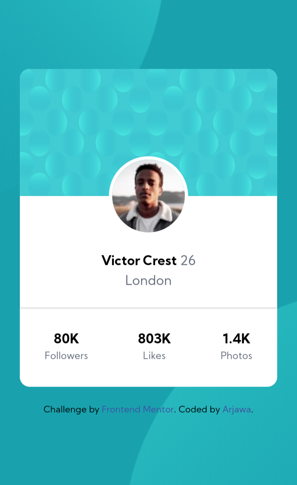

# Frontend Mentor - Profile card component solution

This is a solution to the [Profile card component challenge on Frontend Mentor](https://www.frontendmentor.io/challenges/profile-card-component-cfArpWshJ). Frontend Mentor challenges help you improve your coding skills by building realistic projects. 

## Built with

- Semantic HTML5 markup
- CSS custom properties
- Tailwindcss
- Flexbox
- Mobile-first workflow

## Demo

- Demo URL: [https://arjawa.github.io/profile-card](https://arjawa.github.io/profile-card)

## Screenshots

#### Desktop

#### Mobile

## Credits

- My website - [https://arjawa.tk](https://arjawa.tk)
- Frontend Mentor - [@arjawa](https://www.frontendmentor.io/profile/arjawa)
